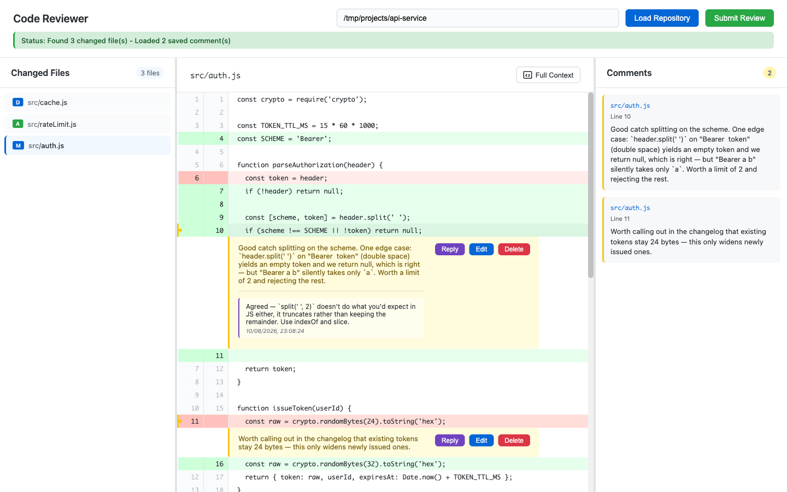
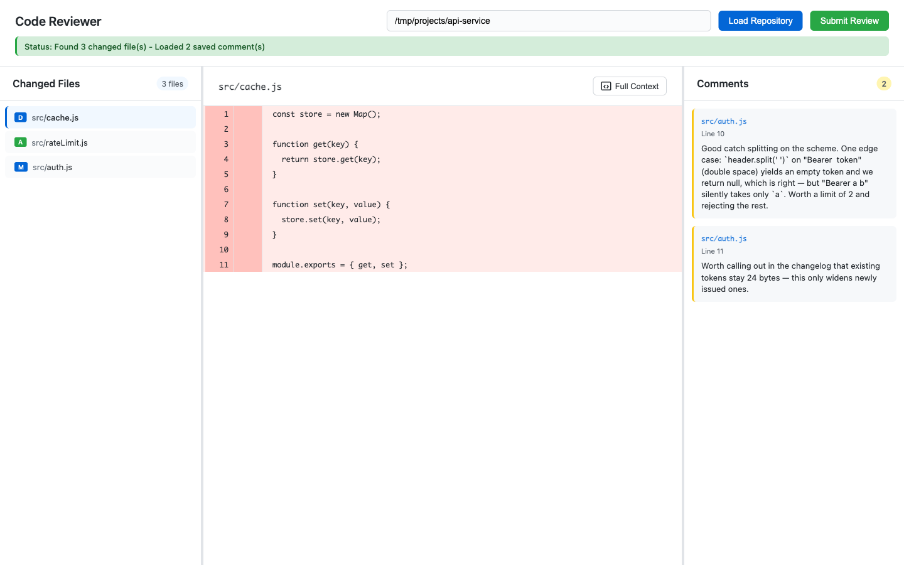
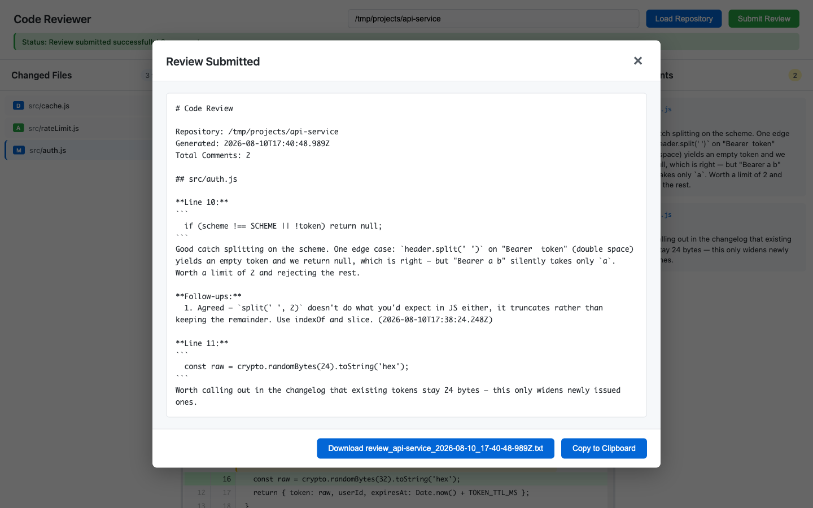

# reviewer

[](https://github.com/dheerajjha/reviewer/actions/workflows/ci.yml)
[](LICENSE)
[](package.json)
[](test/)


Review code before it becomes a pull request. `reviewer` opens any local git
repository, shows what changed, and lets you leave inline comments with
threaded follow-ups — against your working directory, without a branch, a
remote, a push, or an account. Comments persist between sessions and survive
the code moving underneath them, so you can review, edit, and come back
tomorrow to a review that still points at the right lines. When you are done it
writes a plain Markdown file you can paste anywhere.

It runs as a desktop app, or as a local web server if you prefer a browser.

```bash
git clone https://github.com/dheerajjha/reviewer.git
cd reviewer && npm install
npm run electron
```

Then `File > Open Repository` (`Cmd/Ctrl+O`) and pick any git repository.



Click a line number, write the note, keep going. Replies thread under the
comment they answer, and everything is saved as you type.

## What it shows you

`reviewer` picks what to review based on the state of the repository, so there
is nothing to configure:

| Repository state | What you review |
|---|---|
| Uncommitted changes present | Your working directory against `HEAD` |
| Working directory clean | The last commit against its parent |
| No commits yet | Every tracked and untracked file, as wholly new |

Modified, added, deleted, renamed, and binary files are all listed, each marked
with its git status letter. Deleted lines are commentable too — the most useful
review note is often about the code someone removed. A file deleted outright is
shown in full, read back out of `HEAD`:



## Reviewing

| Action | How |
|---|---|
| Comment on a line | Click the line number |
| Comment on a snippet | Hold `Cmd/Ctrl`, select code, then click the line number |
| Reply to a comment | Click **Reply** on it |
| Edit or delete | Hover the comment |
| Finish the review | **Submit Review**, or `Cmd/Ctrl+S` |

| Shortcut | Action |
|---|---|
| `Cmd/Ctrl+O` | Open repository |
| `Cmd/Ctrl+S` | Submit review |
| `Cmd/Ctrl+Enter` | Save the comment being written |
| `Escape` | Cancel input |
| `↑` / `↓` | Move between files |

## What it writes

Two files, both under `reviews/`, both plain text you can read without this
app:

- **`.code-review-comments-<repo>.json`** — the live state of the review. It is
  written on every edit and is the source of truth; reopening the same
  repository restores exactly what is in it.
- **`review_<repo>_<timestamp>.txt`** — a submitted review, rendered from that
  JSON as Markdown, grouped by file and ordered by line:

````markdown
# Code Review

Repository: /work/my-app
Generated: 2026-08-10T12:30:45.678Z
Total Comments: 2

## src/auth.js

**Line 42:**
```
  const token = req.headers.authorization;
```
This trusts the header without checking the scheme.

**Follow-ups:**
  1. Still open after the rebase (2026-08-10T14:02:11.000Z)
````

Timestamps are ISO 8601 rather than a locale format on purpose: a review gets
committed, pasted into a pull request, and read on someone else's machine, so
its shape should not depend on the reader.

Submitting shows you exactly what was written, ready to download or copy:



## Web mode

```bash
npm start                 # http://127.0.0.1:4500
PORT=8080 npm start       # somewhere else
```

Enter a repository path in the header and load it.

The server binds to loopback. It serves the contents of whatever repository you
open, so reaching it should require being on the machine running it — set
`HOST=0.0.0.0` only if you mean it.

## HTTP API

The UI is a client of this; nothing is hidden from you.

| Endpoint | Purpose |
|---|---|
| `GET /api/health` | Liveness, plus the number of open sessions |
| `POST /api/load-repo` | Open a repository; returns a `repoId` and the changed files |
| `GET /api/file/:repoId/:path` | The file's diff, as structured lines |
| `GET /api/file-full/:repoId/:path` | Every line of the file, for context |
| `POST /api/save-comments` | Persist the current comments |
| `GET /api/load-comments/:repoId` | Restore saved comments |
| `POST /api/submit-review` | Render the saved comments to a review file |
| `DELETE /api/cleanup/:repoId` | End the session; files on disk are untouched |

A `repoId` is a random per-session handle, not a path. Requests that resolve
outside the opened repository are refused.

## Development

```bash
npm install
npm test              # 93 tests
npm run test:watch
npm run test:coverage
```

```
main.js       Electron main process — window, menu, server lifecycle
preload.js    Context-isolated IPC bridge
server.js     Express app factory and routes
lib/
  diff.js       unified diff -> structured lines
  paths.js      confines request paths to the repository
  changes.js    git status and commit summaries -> changed files
  comments.js   the persisted comment shape
  review.js     rendering and naming review files
  sessions.js   repoId -> repository
public/       UI: index.html, style.css, app.js
test/         Node test runner; HTTP tests drive real git repositories
```

The request handlers hold no logic worth testing — it lives in `lib/`, and
`server.js` exports `createApp()` so a test can point an instance at a
temporary directory. The HTTP tests do not stub git: each one builds a real
repository in a temp directory and runs real `git` against it, because diff
parsing is exactly where a stub would be wrong in the same way the code is.

Tests run on Linux, macOS, and Windows across Node 18, 20, and 22. See
[CONTRIBUTING.md](CONTRIBUTING.md).

## Building the desktop app

```bash
npm run build         # current platform
npm run build:mac     # universal DMG + ZIP
npm run build:win     # NSIS + portable
npm run build:linux   # AppImage + DEB
```

Output lands in `dist/`. macOS signing and notarization need an Apple Developer
certificate; Windows and Linux builds need nothing extra.

## Security

The desktop shell follows Electron's guidance — context isolation on, node
integration off, IPC through a preload bridge, no remote module, external links
opened in the real browser. The server binds to loopback, and every path that
reaches the filesystem is resolved through a check that it lands inside the
opened repository.

If you find a way past that, please report it through
[security advisories](https://github.com/dheerajjha/reviewer/security/advisories/new)
rather than a public issue.

## Tech

Electron, Express, [simple-git](https://github.com/steveukx/git-js), and vanilla
JavaScript in the browser. Three runtime dependencies, no build step for the
frontend, no test framework — the tests use the one built into Node.

## License

[MIT](LICENSE) © Dheeraj Jha
